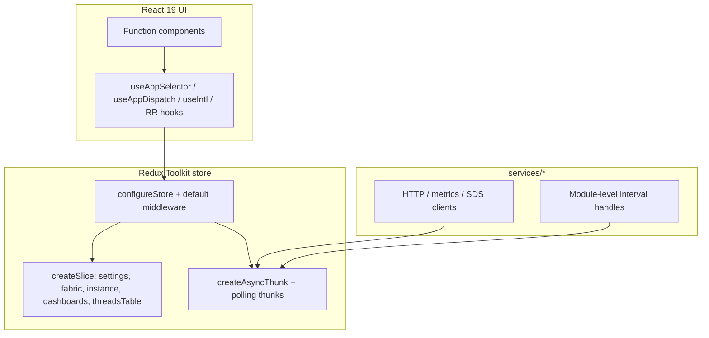
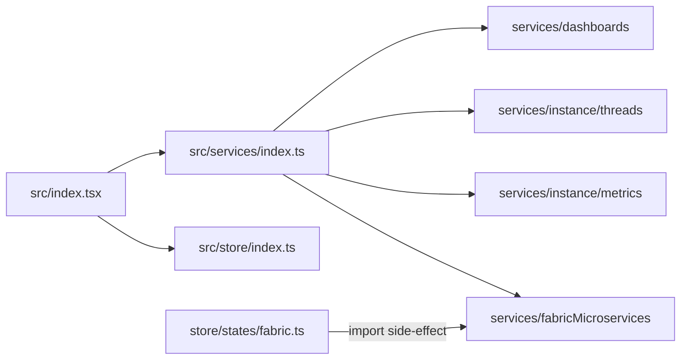
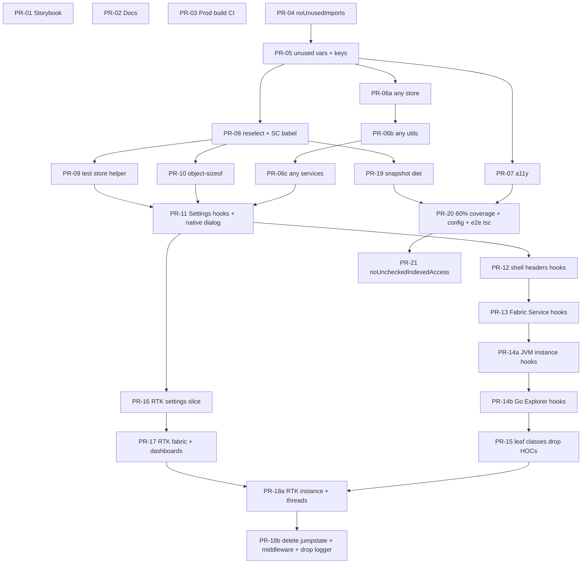

# Post–Biome/TS7 Modernization Program

| Field | Value |
| --- | --- |
| **Title** | Post–Biome/TS7 Modernization Program (Executable Design + PR DAG) |
| **Author** | _TBD_ |
| **Date** | 2026-07-13 |
| **Status** | Draft (rev 3 — user decisions: coverage 60%, drop redux-logger, native dialog) |
| **Repo** | `service-mesh-dashboard` (`gm-fabric-dashboard`) |
| **Baseline** | `master` after PR #238 (Node 22 / pnpm 11 / Vite 8 / Vitest 4 / Playwright / Biome 2.5.3 / TypeScript 7.0.2 / React 19) — author assertion; not re-verified against GitHub in review |

---

## Overview

The tooling stack for **GM Fabric Dashboard** is modern: Node 22, pnpm 11, Vite 8, Vitest 4, Playwright, Biome 2.5.3, TypeScript 7 (strict `tsc --noEmit`), and React 19 with the automatic JSX runtime. Application architecture, however, still reflects a 2017–2019 React/Redux style: a local **jumpstate** shim (`src/store/jumpstate.ts`) on top of RTK `configureStore` with **all default middleware replaced**, 21 class components, **18 production `connect()` sites**, **zero** `useSelector`/`useDispatch`, HOC stacks (`withRouter`, `withUrlState`, `injectIntl`), a large Biome OFF list left intentionally green during the TS migration, stale npm/Node-8 docs, and a Storybook stories glob that does not match `.tsx` stories.

This document turns the modernization plan into an **executable PR DAG** (**~25 PR nodes**, ids `PR-01`…`PR-21` plus lettered splits `PR-06a/b/c`, `PR-14a/b`, `PR-18a/b`) suitable for sequential/`/execute-plan` work. The program ratchets quality without a rewrite: fix Storybook and docs, close CI gaps, re-enable Biome rules in waves, clean dependencies, convert screens to hooks, migrate jumpstate to RTK slices behind stable seams (with **shim delete + middleware restore in a dedicated PR**), then improve tests and TypeScript hardness (`noUncheckedIndexedAccess` as **PR-21**).

---

## Background & Motivation

### Current modern tooling (done)

Verified from `package.json`, `tsconfig.json`, `vite.config.js`, `biome.json`, `.github/workflows/test.yml`:

| Layer | Version / state |
| --- | --- |
| Runtime | Node `>=22.13.0`, pnpm `11.5.0`, `packageManager` pinned |
| Build | Vite `^8.1.3`; `@vitejs/plugin-react` v6 (Oxc); `@rolldown/plugin-babel` + `babel-plugin-styled-components` for SC |
| Unit tests | Vitest `^4.1.10`, `globals: true`, setup under `config/jest/*` |
| E2E | Playwright `^1.61.1`, **Chromium-only for this program** (KD-22), `pnpm start` webServer |
| Lint/format | Biome `2.5.3`, recommended preset with large OFF list |
| Types | TypeScript `^7.0.2`, `strict: true`, `pnpm typecheck` CI job |
| React | `^19.2.7`, automatic JSX runtime |
| Redux | `@reduxjs/toolkit` `^2.12.0` + `redux` `^5.0.1` + `react-redux` `^9` |

> **Note:** The jumpstate shim header comment still says “backed by plain redux@4”; runtime is **redux@5**. Do not re-assert redux@4 in migration notes.

CI jobs today: **unit**, **typecheck**, **lint (Biome)**, **e2e**. There is **no** production `pnpm build` job and **no** Storybook build job.

### Application debt (verified)

| Area | Evidence |
| --- | --- |
| **State** | `src/store/index.ts` uses `configureStore` but `middleware: () => middlewares as any` — RTK defaults (thunk, immutability/serializability checks) **disabled**. Slices are jumpstate `State({...})` reducers in `src/store/states/{settings,fabric,instance,dashboards,threadsTable}.ts`. Effects registered in `src/services/**`. Global `Actions` / `getState` from `src/store/jumpstate.ts`. ~68 `Actions.` call sites; services import `Effect`/`getState` extensively. **UI also calls `getState`:** `ThreadsGrid.tsx`. |
| **React patterns** | **21** class components. **18** production `connect()` export sites. **0** `useSelector`/`useDispatch`. HOC shims: `src/utils/withRouter.tsx`, `src/utils/injectIntl.tsx`, `src/components/withUrlState.tsx`. |
| **Lint** | `biome.json`: all listed a11y rules OFF; `noUnusedImports`/`noUnusedVariables`/`noUnusedFunctionParameters` OFF; `noExplicitAny` OFF; `noNonNullAssertion` OFF; `useJsxKeyInIterable` OFF; many complexity/style rules OFF (see **Deferred Biome backlog**). |
| **Deps** | Standalone `reselect` (only `createSelector` in 3 selector files); `redux-logger`; `redux-mock-store` in many tests; `object-sizeof` in `instance.ts` + `SettingsGrid.tsx`; `dygraphs`; `react-modal`; `babel-plugin-styled-components` **^1.4.0**; `jest-styled-components` (setup + ~5 test files with `toHaveStyleRule`). |
| **Storybook** | `.storybook/main.js` stories glob is `../src/**/*.stories.@(js|jsx)` but **all 18 stories are `.tsx`**. Comment still references `Button.stories.js`. |
| **Docs** | README still says Node 8 / `npm install` / `npm start`. CONTRIBUTING still PropTypes + `npm test`. `docs/installation.md` still Jest/`npm`. `CLAUDE.md` is accurate (source of truth). |
| **PropTypes** | Runtime PropTypes module already removed; only stale comments in `src/types.ts` and docs remain. |
| **Tests** | ~440 unit tests (`it`/`test`), ~215 snapshots (**53** under Glyphs alone), RTL minority, e2e ~7 specs Chromium-only. |
| **Scale** | ~412 `.tsx`, ~233 non-test `.ts`, ~383 `any`-related matches under `src/`. |

### Pain points

1. **Storybook is broken for discovery** — glob misses every story.
2. **Onboarding docs lie** — new contributors follow npm/Node 8 paths that fail.
3. **CI does not prove production builds** — Vite/Rolldown regressions can land green.
4. **Jumpstate + disabled RTK middleware** blocks serializability checks, typed hooks, and standard RTK patterns; migrating later without hooks conversion is harder.
5. **Biome OFF list** freezes quality gains from the linter already in CI.
6. **Snapshot weight** (especially Glyphs) makes refactors expensive and conceals weak behavioral coverage.

---

## Goals & Non-Goals

### Goals

1. Restore Storybook story discovery; keep Storybook build green in CI.
2. Align README / CONTRIBUTING / `docs/installation.md` with pnpm + Node 22 + Vitest + Playwright + Biome (CLAUDE.md remains authoritative until docs land).
3. Add CI jobs for **production build** (and Storybook build after the glob fix).
4. Ratchet **scheduled** Biome rules: unused imports → correctness/unused vars → `noExplicitAny` directory waves (store → utils → services) → a11y (warn → fix → error). Remaining recommended-preset OFF rules are an explicit **post-program backlog** (not silent scope creep).
5. Remove redundant deps (`reselect`, `redux-mock-store`, `object-sizeof`, `redux-logger`, `react-modal`) and bump `babel-plugin-styled-components` to 2.x when snapshots allow.
6. Convert class + `connect` + HOC screens to function components + hooks, **screen-by-screen**, leaving `ErrorBoundary` as a class (required for error lifecycle). In the Settings hooks pilot (**PR-11**), replace `react-modal` with native `<dialog>` (via `ConfirmationModal`).
7. Migrate jumpstate → RTK slices behind feature seams (settings pilot → fabric+dashboards → instance+threads → **delete shim / restore middleware / drop redux-logger + document Redux DevTools**), then improve tests and TypeScript hardness.
8. Improve test quality: Glyphs snapshot diet, reduce `jest-styled-components`/`toHaveStyleRule` reliance, **coverage gate at 60% lines**, rename `config/jest` when safe — **snapshot diet may run parallel to hooks/RTK**.
9. Late TS hardening: e2e typecheck in PR-20; **`noUncheckedIndexedAccess` as PR-21** after the coverage gate.

### Non-Goals

- Full design-system rewrite or visual redesign.
- Monorepo / package split.
- Replacing Playwright or Vitest.
- Re-adding ESLint or Prettier.
- Big-bang RTK migration or rewriting all Actions sites in one PR.
- Full dygraphs replacement (only if pain forces a late, optional PR).
- Multi-browser e2e matrix expansion (out of scope unless a follow-up is filed).
- **Repo-wide** enablement of every Biome recommended-preset rule currently OFF (complexity style bulk, etc.) — see Deferred Biome backlog.

---

## Key Decisions

| # | Decision | Rationale |
| --- | --- | --- |
| KD-1 | **Ratchet, don't rewrite** — enable Biome rules as `warn` then `error` after autofix/targeted PRs | Migration already proved green CI is non-negotiable; large OFF list exists so TS landings stayed green. Waves keep PRs reviewable. |
| KD-2 | **Hooks conversion before RTK slice migration for UI overall**; services keep `Actions.*` until the corresponding slice PR | `connect`→hooks unblocks typed hooks and removes HOC stacks. Settings RTK pilot (PR-16) **hard-depends only on PR-11** (Settings already on hooks), not the full hooks wave. |
| KD-3 | **Keep jumpstate shim until PR-18b**; do not re-add npm `jumpstate` | Shim is intentional (#39). Removing mid-flight forces every call site at once. PR-18a may finish last slices while shim/middleware still exist if needed for residual Effect registration; PR-18b deletes only at zero imports. |
| KD-4 | **RTK pilot = `settings` slice** (not the Settings **screen**) | Smallest surface: 2 reducers (`setThreadsFilter`, `setUserLocale`), no Effects. Proves `createSlice` + store wiring. The Settings **screen** (PR-11) is a **hooks** pilot that still dispatches fabric/instance `Actions.*`. Locale dispatch sites (`LanguageSelector`) are updated in **PR-16**. |
| KD-5 | **Effects → thunks + module-level timers (not listenerMiddleware as default)** | Jumpstate Effects run post-reducer via custom middleware. Map fetches to `createAsyncThunk`; map start/stop polling to plain thunks that own the same `window.*PollingInterval` / module-handle pattern already in use. Avoid inventing a second global `Actions` bag. `createListenerMiddleware` is optional sugar later, not required for parity. |
| KD-6 | **Restore RTK default middleware only in PR-18b after all Effects are gone** | Current `middleware: () => [...]` is required for Effect timing. Restoring defaults while any `Effect()` remains is unsafe. |
| KD-7 | **`createSelector` from `@reduxjs/toolkit`** | RTK re-exports reselect; standalone package is redundant. |
| KD-8 | **Prefer hooks over HOCs as classes convert**; delete HOC shim files only when unused | Shims exist solely for gradual migration. |
| KD-9 | **ErrorBoundary stays a class** | Requires `componentDidCatch` / `getDerivedStateFromError`. |
| KD-10 | **CLAUDE.md is source of truth until docs PRs merge** | Docs are stale. |
| KD-11 | **Glyphs snapshots: collapse or smoke-test** | 53 snaps are high churn / low signal. |
| KD-12 | **a11y rules need product review for intentional patterns** | Enable as `warn` first; promote after exceptions documented. |
| KD-13 | **No coverage gate until snapshot diet (PR-19)**; floor is **60% lines** (`@vitest/coverage-v8`) in **PR-20** | Snapshot diet has **no hard dep on RTK**; only process caution vs concurrent snapshot churn from PR-08. Floor decided by product (closes former OQ-3). |
| KD-14 | **~25 PR nodes (lettered splits OK), not 50 micro or 5 mega** | Splits for `noExplicitAny`, instance hooks, and RTK teardown keep reviewability without micro-PR thrash. Includes PR-21 for indexed access. |
| KD-15 | **No jumpstate action-type parity with RTK** — each slice PR greps and updates **every** producer of that action; accept default RTK types `name/reducer` (e.g. `settings/setUserLocale`) | Default `createSlice` namespaces types. Promising flat jumpstate names (`setUserLocale`) without `type` overrides is a footgun. Dual registration of Effects throws. Delete-as-you-go: remove `Actions.X` / `Effect("X")` for migrated actions in the **same** PR. |
| KD-16 | **Metrics cache: max timestamp sample count (ring buffer), not byte sizing**; default **`METRICS_CACHE_MAX_SAMPLES = 60`** | Deterministic, aligns with existing `_sliceMetrics(oldest timestamp)` structure; removes `object-sizeof`. **60** ≈ 5 minutes at the default 5s poll interval. Settings UI can show sample count and/or optional `JSON.stringify` length for display only. Closes former OQ-1 and OQ-8. |
| KD-17 | **Do not keep a transitional `Actions` façade re-exporting slice actions** | Delete-as-you-go (KD-15) is clearer than a half-global bag that hides incomplete migrations. Temporary dual patterns are OK only as “this file still uses jumpstate; that file uses dispatch(slice)”. |
| KD-18 | **Remove `redux-logger`; developers use Redux DevTools** | Logger is redundant once default RTK middleware + DevTools extension work. Drop package in **PR-18b** (with middleware restore). Document DevTools in CLAUDE.md / CONTRIBUTING (and PR-02 docs if already open). Test store never needs logger. |
| KD-19 | **Replace `react-modal` with native `<dialog>` in PR-11** | Sole production use is `ConfirmationModal` → `StyledModal` (Settings clear-cache). Native dialog + minimal styled wrapper improves a11y baseline and removes `react-modal` / `@types/react-modal`. |
| KD-20 | **Glyph/Icon decorative SVGs: permanent documented ignores** | In PR-07, keep `noSvgWithoutTitle` satisfied via **`biome-ignore`** (or path override) on Glyph/Icon decorative marks; set `aria-hidden` where missing. Document in CONTRIBUTING: decorative status/glyph SVGs are not labeled; interactive controls must have accessible names. Do **not** require titles on every Glyph. |
| KD-21 | **`noUncheckedIndexedAccess` in PR-21 after PR-20** | Enable after any-ratchet + coverage/e2e typecheck land. PR-21: `warn` then `error` (or error with targeted fixes). Not post-program-only. |
| KD-22 | **E2E remains Chromium-only for this program** | No Firefox/WebKit Playwright projects or CI jobs in this DAG. Multi-browser is explicit non-goal / post-program optional. |

---

## Proposed Design

### Architecture target (end state)



### Phase map → PR nodes

| Phase | Intent | PR ids |
| --- | --- | --- |
| **0** Hygiene | Storybook, docs, CI build, comment cleanup | PR-01, PR-02, PR-03 |
| **1** Biome waves | unused → correctness → any (store/utils/services) → a11y | PR-04, PR-05, PR-06a, PR-06b, PR-06c, PR-07 |
| **2** Dep cleanup | reselect, SC babel 2.x, mock-store, sizeof (logger in PR-18b; modal in PR-11) | PR-08, PR-09, PR-10 |
| **3** React hooks | class→function, connect→hooks, drop HOCs; native dialog | PR-11 … PR-15 (PR-14a/b) |
| **4** RTK slices | settings → fabric+dashboards → instance+threads → delete shim + drop logger | PR-16, PR-17, PR-18a, PR-18b |
| **5** Tests | snapshot diet (∥ hooks/RTK), **60% line** coverage, config rename | PR-19, PR-20 |
| **6** TS hardening | e2e typecheck; **`noUncheckedIndexedAccess`** | PR-20, **PR-21** |

### Phase 0 — Hygiene (concrete)

#### Storybook (`PR-01`)

File: [`.storybook/main.js`](.storybook/main.js)

```js
// before
stories: ["../src/**/*.stories.@(js|jsx)"],
// after
stories: ["../src/**/*.stories.@(js|jsx|ts|tsx)"],
```

Acceptance: `pnpm build-storybook` discovers all 18 existing `*.stories.tsx` files. Update the comment that still says `Button.stories.js`.

#### Docs (`PR-02`)

| File | Required updates |
| --- | --- |
| `README.md` | Node 22+, pnpm 11, real scripts; remove Node 8 / npm / obsolete lore |
| `CONTRIBUTING.md` | Biome, Vitest, TypeScript props, function components for new code, GitHub Actions; optional early note that Redux DevTools is preferred (full logger removal lands PR-18b) |
| `docs/installation.md` | pnpm + Vitest |

Do **not** invent process that contradicts `CLAUDE.md`.

#### CI (`PR-01` Storybook job + `PR-03` production build)

Extend [`.github/workflows/test.yml`](.github/workflows/test.yml) with `build` (`pnpm build`) and `storybook` (`pnpm build-storybook`) jobs. Permissions stay `contents: read`.

#### PropTypes comment hygiene (`PR-02`)

- Fix stale comments in `src/types.ts` (claims live `components/PropTypes` — **gone**).
- Strip CONTRIBUTING PropTypes bullet.

### Phase 1 — Biome lint waves

**Pattern for every rule wave:**

1. Enable as `"warn"` (or fix first if autofixable, then `"error"`).
2. Run `pnpm run lint:fix` / manual fixes until clean.
3. Flip to `"error"`.
4. Keep CI green.

#### PR-04: `noUnusedImports`

```json
"correctness": { "noUnusedImports": "error" }
```

**No hard dependency on hygiene PRs** (Storybook/docs/build do not affect unused-import fixes). Prefer landing PR-03 first as a *process* convenience only.

#### PR-05: unused locals + list keys

Enable `noUnusedVariables`, `noUnusedFunctionParameters` (prefix `_`), `useJsxKeyInIterable` → error after fixes.

#### `noExplicitAny` — **three DAG nodes** (not one mega-PR)

| PR | `includes` (non-test first) | Goal |
| --- | --- | --- |
| **PR-06a** | `src/store/**` | Type `State` methods / payloads with domain types |
| **PR-06b** | `src/utils/**` | Selectors, helpers |
| **PR-06c** | `src/services/**` | Effect payloads, API JSON as `unknown` + narrow |

Components stay OFF/warn for `noExplicitAny` in this program (dygraphs/interop noise). Post-program optional.

Suggested override (per PR, growing includes):

```json
{
  "includes": ["src/store/**/*.{ts,tsx}"],
  "linter": {
    "rules": {
      "suspicious": { "noExplicitAny": "error" }
    }
  }
}
```

Exclude `**/*.test.*` from the error override initially.

#### PR-07: a11y + optional XSS lint

1. Set currently OFF a11y rules to `"warn"`.
2. Fix high-value: `useButtonType`, `useAltText`, `useValidAnchor`, `noPositiveTabindex` where wrong.
3. **Decorative Glyph/Icon SVGs (KD-20):** permanent documented exceptions — prefer a `biome.json` override for `src/components/Glyphs/**` and `src/components/Icon/**` turning `noSvgWithoutTitle` off (or file-level `biome-ignore` with reason). Ensure decorative marks use `aria-hidden={true}` where they are pure decoration next to text. Document in CONTRIBUTING.
4. Promote fixed non-SVG rules to `"error"` where clean; leave SVG rule off for Glyph/Icon paths.
5. **Grep** `dangerouslySetInnerHTML` under `src/`; if zero intentional uses, promote `noDangerouslySetInnerHtml` to `"error"`; otherwise leave warn with documented sites.

**Risk:** a11y DOM changes — run e2e after navigation/modal batches.

#### Deferred Biome backlog (post-program / not in PR-04…07)

These remain OFF after this program unless a follow-up is filed. Background debt is **acknowledged**, not scheduled:

| Rule group / rule | Status after program |
| --- | --- |
| `style/noNonNullAssertion` | **Deferred** — high churn with metrics indexing; optional follow-up after any-waves. Not in Background “must fix now” path. |
| `suspicious/noImplicitAnyLet` | Deferred with any cleanup |
| `style/useImportType`, `useConst`, `useTemplate`, `useNodejsImportProtocol` | Deferred (style autofix bulk) |
| `suspicious/noArrayIndexKey` | Deferred (list keys need product judgment) |
| `complexity/*` bulk (`noForEach`, `useOptionalChain`, `noBannedTypes`, …) | Deferred |
| `performance/noAccumulatingSpread` | Deferred |
| `correctness/noSwitchDeclarations` | Deferred |
| Components-wide `noExplicitAny: error` | Deferred after PR-06c |

### Phase 2 — Dependency cleanup

#### PR-08: reselect + babel-plugin-styled-components 2.x

Import `createSelector` from `@reduxjs/toolkit` in:

- `src/utils/selectors.ts`
- `src/utils/go/selectors.ts`
- `src/utils/jvm/selectors.ts`

Remove `reselect`. Bump SC babel plugin `^1.4.0` → `^2.x`; update snapshots in the **same** PR if CSS spacing changes.

**Process constraint:** avoid merging other large snapshot PRs (e.g. PR-19) in the same week as PR-08 without coordination — not a hard DAG edge beyond “PR-19 depends on PR-08 if both touch snaps”.

#### PR-09: redux-mock-store (no logger in test helper)

Shared helper:

```ts
// e.g. src/json/createTestStore.ts
import { configureStore } from "@reduxjs/toolkit";
import { CreateJumpstateMiddleware } from "store/jumpstate";

export function createTestStore(preloadedState?: Partial<RootState>) {
  return configureStore({
    reducer: { /* same as src/store/index */ },
    preloadedState: { ...defaults, ...preloadedState } as RootState,
    // Jumpstate middleware only — do **not** attach redux-logger here.
    middleware: () => [CreateJumpstateMiddleware()] as any
  });
}
```

After **PR-18b**, drop Jumpstate middleware from the helper and use default middleware (with the same serializableCheck ignores as production). Also in PR-18b: remove `redux-logger` from production `src/store/index.ts` and `package.json` (KD-18).

Remove `redux-mock-store` + ambient types. **Do not** re-add logger to tests.

#### PR-10: remove `object-sizeof` (KD-16)

**Decision:** ring buffer by **max timestamp sample count** with fixed default:

```ts
/** ~5 minutes of history at the default 5s poll interval (KD-16). */
export const METRICS_CACHE_MAX_SAMPLES = 60;
```

- `appendToMetrics`: while `timestamps.length > METRICS_CACHE_MAX_SAMPLES`, call existing `_sliceMetrics` logic.
- Settings readout: show sample count; optional display-only byte estimate via `JSON.stringify` **not** on the hot append path.
- CHANGELOG: note eviction is sample-count based (behavior under load may differ from former ~100MB byte cap).

Remove `object-sizeof` + ambient module.

### Phase 3 — Class → function + connect → hooks

#### Conversion recipe (use on every screen PR)

**1. Typed store hooks** (add once in PR-11):

```ts
// src/store/hooks.ts
import { useDispatch, useSelector } from "react-redux";
import type { RootState } from "types";
import type { AppDispatch } from "./index";

export const useAppDispatch = useDispatch.withTypes<AppDispatch>();
export const useAppSelector = useSelector.withTypes<RootState>();
```

**2. Replace `connect` → `useAppSelector` / `useAppDispatch`.**

**3. HOC → hooks:**

| HOC | Hook replacement |
| --- | --- |
| `withRouter` | `useNavigate`, `useLocation`, `useParams` |
| `injectIntl` | `useIntl` |
| `withUrlState` | extract `useUrlState()` (HOC already wraps hooks) |

**4. Class → function** (`useState`/`useEffect`); **keep ErrorBoundary as class**.

**5. Tests:** RTL + `createTestStore` + `Provider`.

**6. UI `getState`:** `ThreadsGrid.tsx` uses `getState().fabric.services` — **must** become `useAppSelector` (or props) in **PR-14a**, not deferred to RTK PRs.

**7. Native dialog (PR-11 only for this program):** Replace `react-modal` usage in `ConfirmationModal` / `StyledModal`.

```tsx
// Sketch — ConfirmationModal with native dialog
function ConfirmationModal({ isOpen, onCancel, onConfirm, question, secondary }: Props) {
  const ref = useRef<HTMLDialogElement>(null);
  useEffect(() => {
    const el = ref.current;
    if (!el) return;
    if (isOpen && !el.open) el.showModal();
    if (!isOpen && el.open) el.close();
  }, [isOpen]);
  return (
    <StyledDialog ref={ref} onCancel={onCancel} onClose={onCancel}>
      {/* existing content: CancelX, question, secondary, Actions */}
    </StyledDialog>
  );
}
// StyledDialog = styled.dialog`…` (port visuals from StyledModal; drop react-modal class hooks)
```

Preserve: Esc / backdrop dismiss → `onCancel`; focus trap via `showModal()`; labelled content (`id="question"` / `secondaryText` or `aria-labelledby`). Remove `Modal.setAppElement` / `#root` aria hacks. Update `ConfirmationModal.test.tsx` (drop `react-modal` import). Remove `react-modal`, `@types/react-modal`, and obsolete `styleVariables` comments about react-modal.

#### Screen batches

| PR | Scope | Notes |
| --- | --- | --- |
| **PR-11** | Store hooks + `SettingsGrid` + `PollingSettings` + **`ConfirmationModal` → native `<dialog>`** | **Hooks pilot**, not settings-slice pilot. Still uses `Actions.*` for fabric/instance polling and `clearMetrics`. Reads `settings.fabricServer`. Does **not** require migrating locale reducers. **KD-19:** rewrite modal off `react-modal`; remove dep. |
| **PR-12** | Shell / headers: `Main`, `AppHeader`, header contents, `ConnectedIntlProvider`, `LanguageSelector` | Locale still via `Actions.setUserLocale` until PR-16 |
| **PR-13** | Fabric + Service views | |
| **PR-14a** | JVM instance path: `InstanceView` (shared shell as needed), JVM Summary, `ThreadsGrid` (+ `getState` fix), `ThreadsTableLineItem`, `ThreadCounts`, related connect | e2e `instance-jvm` |
| **PR-14b** | Go instance + Explorer path: Go Summary, `FunctionsGrid`, `RoutesGrid`, `Explorer`, `Inspector`, `GMGrid`, `TableLineItem` | e2e `instance-go` + explorer usage |
| **PR-15** | Leaf classes (`IconBorder`, `IconBackground`, optional `Glyph`); delete unused HOC shims; keep `ErrorBoundary` | |

### Phase 4 — jumpstate → RTK

#### Hybrid strategy (KD-15) — **no type-string parity**

**Chosen approach:** On each slice PR, update **every** producer of that action in the same PR. Accept RTK default action types (`settings/setUserLocale`, `fabric/setFabricMicroservices`, …). **Do not** force flat jumpstate type strings. **Do not** leave residual `Actions.setUserLocale` that still dispatches `{ type: "setUserLocale" }` after the slice owns that field.

```ts
// PR-16 example — settings slice
const settingsSlice = createSlice({
  name: "settings",
  initialState: { /* … */ } satisfies SettingsState,
  reducers: {
    setThreadsFilter(state, action: PayloadAction<string>) {
      state.threadsFilter = action.payload;
    },
    setUserLocale(state, action: PayloadAction<string>) {
      state.locale = action.payload;
    }
  }
});
export const { setThreadsFilter, setUserLocale } = settingsSlice.actions;
// Dispatched type is "settings/setUserLocale" — correct and intentional.
```

```ts
// Call site — same PR
// BEFORE (jumpstate): Actions.setUserLocale("es");
// AFTER:
dispatch(setUserLocale("es"));
```

**Per slice-PR acceptance checklist (mandatory greps):**

```text
rg "Actions\.(setUserLocale|setThreadsFilter)" src
rg "type:\s*['\"]setUserLocale['\"]" src
rg "from [\"']store/jumpstate[\"']" src/store/states/settings.ts  # must be gone
```

For fabric/instance: grep each migrated action name + `Effect("name"`.

**Coexistence with remaining jumpstate:** After PR-16, `settings` is a normal RTK reducer; fabric/instance/threads/dashboards may still be jumpstate `State()` reducers registered beside it in `configureStore`. Jumpstate middleware still runs for remaining Effect names. **Never** re-register an Effect name that was converted to a thunk (Effect() throws on duplicate names).

#### Registration & call graph (must preserve semantics)

**Boot / import graph today:**



| Mechanism | Role |
| --- | --- |
| `src/index.tsx` → `import "./services"` | Registers Effects via `services/index.ts` → instance / dashboards / fabricMicroservices |
| `store/states/fabric.ts` → `import "services/fabricMicroservices"` | Ensures fabric Effects exist when fabric state module loads (module cache prevents double `Effect()`) |
| `CreateJumpstateMiddleware` | Binds global `getState`/`dispatch`; runs Effect after reducer |

**After converting an Effect in a PR:**

1. Delete `Effect("name", …)` registration in the same PR.
2. Export thunk(s) from the service module.
3. Keep entrypoint imports so the module still loads (or register listeners/thunks from `store/index.ts` explicitly).
4. Replace all `Actions.name(...)` call sites with `dispatch(thunk(...))` or `dispatch(sliceAction(...))`.

##### Effect name → file → typical callers

| Effect / action family | Definition | Primary callers |
| --- | --- | --- |
| `loadDashboardsFromJSON` / `setDashboards` | `services/dashboards/index.ts` | `Main`, `selectInstance` effect |
| Fabric fetch/poll/select (`fetchAndStoreFabricMicroservices`, start/stop/interval, success/failure, `selectInstance`) | `services/fabricMicroservices/*` | `Main` (start poll), Settings polling controls, fabric navigation / instance select |
| Instance metrics fetch/poll/purge/interval | `services/instance/metrics/index.tsx` | `selectInstance`, Settings, InstanceView lifecycle |
| Threads fetch/failure → `fetchThreadsSuccess` state | `services/instance/threads/*` + `threadsTable` State | `ThreadsGrid` |
| `getState()` in services | metrics utils, fabricMicroservices, metrics effects | → thunk `api.getState` |
| `getState()` in UI | **`ThreadsGrid.tsx`** only under components | → `useAppSelector` in PR-14a |

##### Polling ownership sketch (preserve module-level timers)

Keep the existing pattern (illustrative; match live `window.refreshInstanceMetricsPollingInterval` / fabric equivalents):

```ts
// services/fabricMicroservices/polling.ts (or keep in existing file)
let fabricPollingHandle: ReturnType<typeof setInterval> | null = null;

export const startPollingFabricMicroservices =
  (opts?: { interval?: number }): AppThunk =>
  (dispatch, getState) => {
    if (fabricPollingHandle) clearInterval(fabricPollingHandle);
    const interval =
      opts?.interval ?? getState().fabric.fabricPollingInterval;
    dispatch(setIsPollingFabric(true));
    dispatch(fetchAndStoreFabricMicroservices());
    fabricPollingHandle = setInterval(() => {
      dispatch(fetchAndStoreFabricMicroservices());
    }, interval);
  };

export const stopPollingFabricMicroservices =
  (): AppThunk => (dispatch) => {
    if (fabricPollingHandle) {
      clearInterval(fabricPollingHandle);
      fabricPollingHandle = null;
    }
    dispatch(setIsPollingFabric(false));
  };
```

UI (`Main`, `SettingsGrid` / `PollingSettings`) after hooks:

```ts
const dispatch = useAppDispatch();
useEffect(() => {
  if (getFabricServer()) dispatch(startPollingFabricMicroservices());
  // stop on unmount only if product semantics require it — today Main starts and leaves poll running
}, [dispatch]);
```

**Do not** dual-register jumpstate Effect + thunk for the same name.

#### Target slices

| Slice | PR | Notes |
| --- | --- | --- |
| `settings` | PR-16 | 2 reducers; update LanguageSelector + any filter call sites |
| `fabric` + `dashboards` | PR-17 | dashboards is tiny (`setDashboards`); pairs with fabric `selectInstance` / load JSON |
| `instance` + `threadsTable` | PR-18a | metrics ring + polling + threads Effects |
| _(none)_ | PR-18b | delete shim; restore middleware; **remove redux-logger**; document Redux DevTools |

#### Store end state (`PR-18b`)

```ts
export const store = configureStore({
  reducer: {
    settings: settingsReducer,
    fabric: fabricReducer,
    instance: instanceReducer,
    dashboards: dashboardsReducer,
    threadsTable: threadsTableReducer
  },
  middleware: (getDefaultMiddleware) =>
    getDefaultMiddleware({
      // High-frequency appendToMetrics on a large nested map.
      serializableCheck: {
        ignoredPaths: ["instance.metrics"],
        ignoredActions: [
          // if needed: instance/appendToMetrics type string
        ]
      },
      immutableCheck: {
        ignoredPaths: ["instance.metrics"]
      }
    })
  // No redux-logger (KD-18). Use Redux DevTools browser extension in development.
});
```

**DevTools:** With default middleware restored, the Redux DevTools extension works out of the box (`configureStore` enables it in dev). Document in CLAUDE.md / CONTRIBUTING: install the browser extension; no app code required. Remove `redux-logger` and `@types/redux-logger` from `package.json`.

**Dev vs prod cost:** RTK already disables serializable/immutable checks in production builds. The ignores above protect **dev** and **unit tests** from O(n) deep walks every 5s poll and from false positives. Add a unit test: append a large fixture metrics object once and assert the reducer completes well under the test timeout.

Prefer storing serializable error messages in `threadsError` (strings), not `Error` instances.

Delete `src/store/jumpstate.ts` only in PR-18b. Grep zero `store/jumpstate`.

### Phase 5 — Test quality

#### PR-19: Snapshot diet + jest-styled-components reduction

**Hard depends on:** PR-08 only (so SC babel 2.x snapshot churn is settled first). **Does not depend on** PR-18 / full hooks.

1. Collapse 53 Glyph snaps → registry smoke or one consolidated snapshot.
2. Migrate `toHaveStyleRule` (~5 files) to `toHaveStyle` / behavioral asserts.
3. Remove `jest-styled-components` when unused.

May run **in parallel** with PR-11…PR-18a.

#### PR-20: Coverage gate + config rename + e2e typecheck

Depends on PR-19 (and preferably PR-07 for a11y floor).

**Coverage floor (KD-13):** **60% lines** via `@vitest/coverage-v8` (already in `package.json`). Configure in `vite.config.js` / Vitest `test.coverage`:

```js
coverage: {
  provider: "v8",
  reporter: ["text", "lcov"],
  lines: 60,
  // Optional: exclude Glyphs / stories if needed to hit a honest floor after PR-19
  // exclude: ["src/components/Glyphs/**", "**/*.stories.tsx"]
}
```

CI: fail unit-test job (or dedicated coverage step) when under floor. Rename `config/jest` → `config/vitest` (or `config/test`); `e2e/tsconfig.json` + CI typecheck step.

### Phase 6 — TS hardening (PR-20 + PR-21)

- **PR-20:** e2e typecheck project + coverage gate.
- **PR-21 (KD-21):** enable `noUncheckedIndexedAccess` in `tsconfig.json` after PR-20. Prefer staged approach: fix store/utils/services first (already any-ratcheted), then components. Acceptance: `pnpm run typecheck` green with the flag on.

---

## API / Interface Changes

### New modules

| Path | Purpose |
| --- | --- |
| `src/store/hooks.ts` | `useAppSelector`, `useAppDispatch` |
| `src/store/states/*.ts` | `createSlice` reducers |
| `useUrlState` export | hook extraction from `withUrlState` |
| `src/json/createTestStore.ts` | replace redux-mock-store |

### Removed modules

| Path | When |
| --- | --- |
| `src/store/jumpstate.ts` | **PR-18b** |
| `redux-logger` (+ `@types/redux-logger`) | **PR-18b** |
| `react-modal` (+ `@types/react-modal`) | **PR-11** |
| HOC shims | PR-15 if unused |

### Action creator migration (end state only — no type parity)

```ts
// before
import { Actions } from "store/jumpstate";
Actions.setUserLocale("es");
Actions.startPollingFabricMicroservices();

// after
import { useAppDispatch } from "store/hooks";
import { setUserLocale } from "store/states/settings";
import { startPollingFabricMicroservices } from "services/fabricMicroservices";

const dispatch = useAppDispatch();
dispatch(setUserLocale("es"));
dispatch(startPollingFabricMicroservices());
```

Services: use thunk `api.getState` / `api.dispatch` — never global jumpstate `getState` after PR-18b.

---

## Data Model Changes

**No backend schema changes.** `RootState` shape preserved.

**Metrics cache (PR-10, KD-16):** byte-threshold eviction → **max sample/timestamp count** with **`METRICS_CACHE_MAX_SAMPLES = 60`**. CHANGELOG note required (eviction timing under load differs from former byte cap).

---

## Alternatives Considered

### A1. Big-bang RTK + hooks rewrite in 1–2 PRs

- **Verdict:** Rejected (KD-2, KD-14).

### A2. Keep jumpstate forever; only convert components to hooks

- **Verdict:** Rejected as end state; intermediate after Phase 3 is fine.

### A3. Adopt Zustand / Jotai / replace Redux

- **Verdict:** Rejected.

### A4. Re-enable all Biome rules in one PR

- **Verdict:** Rejected (KD-1); residual OFF rules are explicit backlog.

### A5. ESLint + typescript-eslint instead of Biome ratchet

- **Verdict:** Rejected.

### A6. `createListenerMiddleware` for all polling vs thunks + module timers

- **Pros (listeners):** declarative cancel, RTK-idiomatic.
- **Cons:** larger rewrite of existing interval/clear helpers; harder 1:1 port of failure counters + “clear then restart” interval change.
- **Verdict:** **Prefer thunks + module-level handles** for migration parity (KD-5). Revisit listeners post-program if desired.

### A7. Early RTK settings pilot before full hooks (PR-16 after PR-11 only)

- **Pros:** Learns RTK early; unblocks store patterns while PR-12…15 continue.
- **Cons:** Brief dual pattern (hooks Settings + class headers still on Actions for other slices).
- **Verdict:** **Accepted as hard DAG rule** — PR-16 **Depends on: PR-11** only. Soft preference to avoid editing LanguageSelector twice is minor (locale is a one-line call-site change).

### A8. Transitional `Actions` bag re-exporting slice action creators

- **Pros:** Fewer import churn lines mid-migration.
- **Cons:** Hides incomplete migrations; conflicts with Effect duplicate-name throws if mixed; looks like jumpstate forever.
- **Verdict:** Rejected (KD-17). Delete-as-you-go.

### A9. Flat action types via `createSlice` `type` overrides to match jumpstate names

- **Pros:** Residual `Actions.foo` could keep working longer.
- **Cons:** Non-idiomatic RTK; invites permanent hybrid; easy to miss a call site and “think” it works.
- **Verdict:** Rejected in favor of KD-15.

---

## Security & Privacy Considerations

| Topic | Notes |
| --- | --- |
| **Threat model** | Admin UI; XSS via metrics/service names. |
| **`dangerouslySetInnerHTML`** | Grep in PR-07; promote `noDangerouslySetInnerHtml` to error if unused. |
| **Auth** | No change. |
| **Dependencies** | Remove unused packages (`reselect`, mock-store, sizeof, logger, react-modal); SC babel bump uses existing Babel 8 peer. Native `<dialog>` reduces third-party modal attack surface. |
| **CI permissions** | `contents: read` only. |

---

## Observability

| Layer | Approach |
| --- | --- |
| **App logging** | Existing console in Main/polling; no new noise. |
| **Redux** | After PR-18b: **no redux-logger**; use **Redux DevTools** browser extension (enabled by `configureStore` in dev). Document for contributors. |
| **CI** | build + storybook jobs; **60% line** coverage floor after PR-20. |
| **E2E** | Playwright HTML artifact retained. |
| **Perf footgun** | Ignore `instance.metrics` in serializable/immutable checks (dev); RTK disables those checks in production. |

**Latency:** polling default 5s unchanged.

---

## Rollout Plan

### Feature flags

None required.

### Staging strategy

1. Phase 0–2 free (low product risk); Phase 1 lint may start **without** waiting on docs/Storybook.
2. Phase 3–4: unit + e2e green; squash-merge as today.
3. After each RTK PR: fabric → service → JVM + Go instance → settings cache → locale.

### Rollback

Each PR independently revertable. **PR-18a** vs **PR-18b** gives a thin boundary: if middleware restore breaks, revert 18b without undoing slice ports.

### Parallelism

| Set | PRs | Notes |
| --- | --- | --- |
| A | PR-01, PR-02, PR-03 | No code overlap; **does not block** PR-04 |
| B | PR-06a ∥ PR-07 (after PR-05); PR-06b after 06a; PR-06c after 06b | any waves serial among themselves for review clarity |
| C | PR-09 ∥ PR-10 after PR-08 | |
| D | **PR-19 ∥ PR-11…PR-18a** after PR-08 | process: avoid simultaneous snapshot wars with PR-08 |
| Serial | PR-11→12→13→14a→14b→15; PR-16 can start after PR-11; PR-17→18a→18b; PR-20 after PR-19 | |

Recommended critical path (not unique):

`PR-04 → PR-05 → PR-06a→06b→06c → PR-08 → PR-09/10 → PR-11 → PR-12…15 / PR-16…18b` with **PR-19** off the critical path after PR-08.

---

## Risks

| Risk | Severity | Mitigation |
| --- | --- | --- |
| Snapshot churn (SC babel / Glyphs) | Medium | PR-08 owns SC snaps; PR-19 after PR-08; coordinate calendar |
| Polling/timer regressions | **High** | Module-level handles; unit tests; e2e; registration checklist |
| RTK serializable/immutable cost on metrics | Medium | Ignore `instance.metrics`; large-fixture unit test (Phase 4) |
| a11y product conflicts | Medium | warn-first (KD-12) |
| Dual store patterns mid-migration | Medium | KD-15 checklists; no Actions façade |
| Metrics eviction behavior change | Low–Med | KD-16 + CHANGELOG + tests |
| PR-14 size | Medium | **Pre-split PR-14a / PR-14b** |
| PR-18 overload | **High** | **Split PR-18a / PR-18b** |
| Native `<dialog>` a11y/visual parity | Medium | Port StyledModal CSS; RTL tests for open/close/Esc/confirm; smoke Settings clear-cache |
| Coverage 60% initially red | Low–Med | PR-19 first; exclude Glyphs/stories only if needed and document |

---

## Open Questions

All program-blocking open questions are **decided**. Residual non-goals (not open decisions):

1. ~~Metrics cache policy~~ — **Decided (KD-16):** max timestamp samples.
2. ~~a11y Glyph/Icon SVGs~~ — **Decided (KD-20):** permanent documented ignores / path override; decorative marks use `aria-hidden` where appropriate.
3. ~~Coverage floor~~ — **Decided (KD-13):** **60% lines** in PR-20.
4. ~~`noUncheckedIndexedAccess`~~ — **Decided (KD-21):** **PR-21** after PR-20.
5. ~~redux-logger~~ — **Decided (KD-18):** remove; Redux DevTools; drop in PR-18b.
6. ~~react-modal~~ — **Decided (KD-19):** native `<dialog>` in PR-11.
7. ~~Multi-browser e2e~~ — **Decided (KD-22):** **Chromium-only** for this program; Firefox/WebKit out of scope.
8. ~~`METRICS_CACHE_MAX_SAMPLES`~~ — **Decided (KD-16):** **`60`**.

**Post-program optional (not in DAG):** multi-browser e2e; components-wide `noExplicitAny`; bulk complexity/style Biome rules from the deferred backlog table.

---

## References

- Repo guide: [`CLAUDE.md`](C:\Users\sean\projects\service-mesh-dashboard\CLAUDE.md)
- Jumpstate shim: [`src/store/jumpstate.ts`](C:\Users\sean\projects\service-mesh-dashboard\src\store\jumpstate.ts) (comment mentions redux@4; package is redux@5)
- Store bootstrap: [`src/store/index.ts`](C:\Users\sean\projects\service-mesh-dashboard\src\store\index.ts)
- Domain types / `RootState`: [`src/types.ts`](C:\Users\sean\projects\service-mesh-dashboard\src\types.ts)
- Biome config: [`biome.json`](C:\Users\sean\projects\service-mesh-dashboard\biome.json)
- CI: [`.github/workflows/test.yml`](C:\Users\sean\projects\service-mesh-dashboard\.github\workflows\test.yml)
- Storybook: [`.storybook/main.js`](C:\Users\sean\projects\service-mesh-dashboard\.storybook\main.js)
- Entry services import: [`src/index.tsx`](C:\Users\sean\projects\service-mesh-dashboard\src\index.tsx) (`import "./services"`)
- Fabric side-import: [`src/store/states/fabric.ts`](C:\Users\sean\projects\service-mesh-dashboard\src\store\states\fabric.ts)
- UI getState: [`ThreadsGrid.tsx`](C:\Users\sean\projects\service-mesh-dashboard\src\components\Main\scenes\InstanceView\scenes\JVMInstanceView\scenes\Threads\ThreadsGrid.tsx)
- Issues: #39 (jumpstate), #172 (PropTypes→TS), #211 (SDS CORS)
- RTK docs: `configureStore`, `createSlice`, `createAsyncThunk`, `createSelector`

---

## Implementation Notes for Executors

### Acceptance bar (every PR)

- [ ] `pnpm install --frozen-lockfile` clean  
- [ ] `pnpm run typecheck`  
- [ ] `pnpm run lint`  
- [ ] `pnpm test` (CI mode)  
- [ ] `pnpm test:e2e` when touching routing, polling, settings, i18n, or store  
- [ ] `pnpm build` when build job exists  
- [ ] No new `jest.*` APIs; use `vi.*` only  
- [ ] Do not re-add npm `jumpstate` or ESLint/Prettier  
- [ ] Slice PRs: KD-15 grep checklist for every migrated action  

### File inventory anchors

**Class components (21):**  
`ErrorBoundary`, `ThreadCounts`, `InstanceHeaderContent`, `IconBorder`, `IconBackground`, `ServiceView`, `LanguageSelector`, `Glyph`, `Explorer`, `ThreadsGrid`, `GMGrid`, `Inspector`, `ThreadsTableLineItem`, `SettingsGrid`, `TableLineItem`, `PollingSettings`, `Main`, `FunctionsGrid`, `RoutesGrid`, `FabricGrid`, `ServicesListItem`.

**Production `connect()` sites (18):**  
`ConnectedIntlProvider`, `AppHeader`, `ServiceHeaderContent`, `InstanceHeaderContent`, `FabricHeaderContent`, `ThreadCounts`, `RoutesGrid`, `ThreadsGrid`, `FabricRouter`, `Main`, JVM `Summary`, Go `Summary`, `FunctionsGrid`, `InstanceView`, `Explorer`, `GMGrid`, `SettingsGrid` — plus any residual listed in grep at execute time.

**Jumpstate Effects (services):**  
`loadDashboardsFromJSON`; fabric: fetch/store/success/failure/poll start-stop/interval/selectInstance; instance metrics: fetch/store/success/failure/poll start-stop/purge/interval; threads: fetch/store/failure.

---

## PR Plan

Machine-friendly DAG for `/execute-plan`. Stable ids: `PR-01`…`PR-21` with splits `PR-06a`, `PR-06b`, `PR-06c`, `PR-14a`, `PR-14b`, `PR-18a`, `PR-18b`.

### Dependency diagram



### Topological order

1. **Parallel set A (optional early):** PR-01, PR-02, PR-03  
2. PR-04 → PR-05  
3. **Parallel:** PR-06a chain (06a→06b→06c), PR-07, PR-08  
4. **Parallel:** PR-09, PR-10, **PR-19** (after PR-08)  
5. PR-11 → PR-12 → PR-13 → PR-14a → PR-14b → PR-15  
6. PR-16 may start **as soon as PR-11 lands** (parallel with PR-12…15)  
7. PR-17 → PR-18a → PR-18b  
8. PR-20 after PR-19 (+ PR-07 preferred)  
9. **PR-21** after PR-20 (`noUncheckedIndexedAccess`)

### Parallelism summary

| Set | PRs |
| --- | --- |
| A | PR-01, PR-02, PR-03 |
| Lint/deps | After PR-05: PR-07 ∥ PR-08 ∥ PR-06a… |
| After PR-08 | PR-09 ∥ PR-10 ∥ PR-19 |
| After PR-11 | PR-16 ∥ PR-12…15 |
| Serial RTK finish | PR-17 → PR-18a → PR-18b |
| Closeout | PR-20 → PR-21 |

---

### PR-01 — Fix Storybook stories glob and add Storybook CI job

- **Title:** `build: fix Storybook TSX glob and CI storybook job`
- **Depends on:** _(none)_
- **Files/components:** `.storybook/main.js`, `.github/workflows/test.yml`
- **Description:** Expand stories glob to `*.@(js|jsx|ts|tsx)`; add Storybook CI job; fix `Button.stories.js` comment.
- **Acceptance:** All 18 stories discovered; `pnpm build-storybook` green in CI
- **Risk:** Low

---

### PR-02 — Modernize contributor docs and PropTypes comment hygiene

- **Title:** `docs: align README/CONTRIBUTING/installation with pnpm Node 22 Vitest`
- **Depends on:** _(none)_
- **Files/components:** `README.md`, `CONTRIBUTING.md`, `docs/installation.md`, `src/types.ts` comments
- **Description:** Replace npm/Node 8/Jest/PropTypes guidance; fix obsolete PropTypes module comments.
- **Acceptance:** Docs match real commands; no claim PropTypes runtime module exists
- **Risk:** Low

---

### PR-03 — Add production Vite build CI job

- **Title:** `ci: add production pnpm build job`
- **Depends on:** _(none)_
- **Files/components:** `.github/workflows/test.yml`
- **Description:** New `build` job running `pnpm build`.
- **Acceptance:** Job green on master
- **Risk:** Low

---

### PR-04 — Biome: enable `noUnusedImports` as error

- **Title:** `lint: enable Biome noUnusedImports`
- **Depends on:** _(none)_
- **Files/components:** `biome.json`; autofixed sources
- **Description:** `"noUnusedImports": "error"` + lint fix. Independent of Storybook/docs/build.
- **Acceptance:** `pnpm run lint` clean; typecheck/tests green
- **Risk:** Low

---

### PR-05 — Biome: unused variables/parameters and `useJsxKeyInIterable`

- **Title:** `lint: ratchet unused locals and list keys`
- **Depends on:** PR-04
- **Files/components:** `biome.json`; list renders under `src/components/**`
- **Description:** Enable unused vars/params + jsx keys to error after fixes.
- **Acceptance:** Rules at error; unit tests green
- **Risk:** Low–Medium

---

### PR-06a — Biome: `noExplicitAny` error for `src/store`

- **Title:** `lint: noExplicitAny error for store`
- **Depends on:** PR-05
- **Files/components:** `biome.json` override; `src/store/**` (non-test)
- **Description:** First any-ratchet directory only.
- **Acceptance:** Store tree clean under override
- **Risk:** Medium

---

### PR-06b — Biome: `noExplicitAny` error for `src/utils`

- **Title:** `lint: noExplicitAny error for utils`
- **Depends on:** PR-06a
- **Files/components:** `biome.json`; `src/utils/**`
- **Description:** Second any-ratchet directory.
- **Acceptance:** Utils tree clean under override
- **Risk:** Medium

---

### PR-06c — Biome: `noExplicitAny` error for `src/services`

- **Title:** `lint: noExplicitAny error for services`
- **Depends on:** PR-06b
- **Files/components:** `biome.json`; `src/services/**`
- **Description:** Third any-ratchet directory; API JSON as `unknown` + narrow.
- **Acceptance:** Services tree clean under override
- **Risk:** Medium

---

### PR-07 — Biome: a11y rules warn + high-value fixes

- **Title:** `a11y: enable Biome a11y as warn and fix safe violations`
- **Depends on:** PR-05
- **Files/components:** `biome.json`; components for buttons/links/icons/modals; `CONTRIBUTING.md` a11y note
- **Description:** a11y OFF→warn; safe fixes for buttons/links/tabIndex. **KD-20:** permanent Glyph/Icon exception for `noSvgWithoutTitle` (path override or documented ignores) + `aria-hidden` on decorative marks. Grep `dangerouslySetInnerHTML` and promote security rule if unused.
- **Acceptance:**
  - Interactive controls fixed or justified
  - Glyph/Icon SVG policy documented in CONTRIBUTING
  - e2e green if DOM changed
- **Risk:** Medium

---

### PR-08 — Drop standalone reselect; bump babel-plugin-styled-components

- **Title:** `build: createSelector from RTK; SC babel plugin 2.x`
- **Depends on:** PR-05
- **Files/components:** `package.json`, lockfile, three selector files, snapshots if needed
- **Description:** RTK `createSelector`; remove `reselect`; SC babel 2.x + snapshot update if required.
- **Acceptance:** Tests + production build green
- **Risk:** Medium (snapshot CSS)

---

### PR-09 — Replace redux-mock-store with real test store helper

- **Title:** `test: replace redux-mock-store with configureStore helper`
- **Depends on:** PR-08
- **Files/components:** `createTestStore` helper; tests using mock-store; `global.d.ts`; `package.json`
- **Description:** Migrate tests off `redux-mock-store`; remove dep. Test helper uses Jumpstate middleware only — **no redux-logger**. Logger package remains until PR-18b (KD-18).
- **Acceptance:** Zero `redux-mock-store` imports; test helper has no logger
- **Risk:** Medium

---

### PR-10 — Remove object-sizeof; sample-budget metrics cache

- **Title:** `refactor: remove object-sizeof; max-sample metrics cache`
- **Depends on:** PR-08
- **Files/components:** `src/store/states/instance.ts`, `SettingsGrid.tsx`, tests, `global.d.ts`, `package.json`, `CHANGELOG.md`
- **Description:** Implement KD-16 ring buffer with **`METRICS_CACHE_MAX_SAMPLES = 60`** (~5 min at 5s poll). Settings shows sample count; CHANGELOG note (sample-count eviction vs former byte cap).
- **Acceptance:**
  - Constant exported and used on append path
  - No `object-sizeof` in package/lock/ambient types
  - Unit tests cover eviction at 60 samples
  - Settings readout works
- **Risk:** Medium

---

### PR-11 — Store hooks + Settings conversion + native dialog (hooks pilot)

- **Title:** `refactor: Settings hooks pilot; replace react-modal with native dialog`
- **Depends on:** PR-06c, PR-09, PR-10
- **Files/components:** `src/store/hooks.ts`, `src/store/index.ts` (`AppDispatch`), `SettingsGrid.tsx`, `PollingSettings.tsx`, Settings tests; **`ConfirmationModal/**`** (`ConfirmationModal.tsx`, `StyledModal.ts` → styled `dialog`, tests); `package.json` (remove `react-modal`, `@types/react-modal`); `style/styleVariables.ts` comment cleanup if it mentions react-modal
- **Description:** **Hooks pilot** (not settings-slice pilot). Convert Settings classes; `connect`→hooks; `useIntl`. **Still dispatch `Actions.*`** for fabric/instance polling and `clearMetrics`. Does **not** migrate settings slice to RTK (PR-16). Locale call sites remain until PR-16. **KD-19:** rewrite `ConfirmationModal` on native `<dialog>` (`showModal`/`close`); port styles from `StyledModal`; preserve Esc/backdrop cancel + confirm/cancel actions; drop `react-modal` entirely (only consumer).
- **Acceptance:**
  - Settings polling controls + clear-cache **dialog** work (open/confirm/cancel/Esc)
  - Unit tests green for Settings + ConfirmationModal; no `connect(` in Settings files
  - `rg "react-modal" .` → 0 (except CHANGELOG if any)
  - `react-modal` / `@types/react-modal` removed from package.json
- **Risk:** Medium–High (a11y/focus + visual parity for modal)

---

### PR-12 — Convert shell and header stack to hooks

- **Title:** `refactor: Main AppHeader and header contents to hooks`
- **Depends on:** PR-11
- **Files/components:** `Main.tsx`, `AppHeader.tsx`, `ConnectedIntlProvider.tsx`, header contents, `LanguageSelector.tsx`, tests
- **Description:** Remove connect/HOCs from chrome; LanguageSelector may still call `Actions.setUserLocale` until PR-16.
- **Acceptance:** e2e smoke + i18n Spanish green
- **Risk:** Medium

---

### PR-13 — Convert Fabric and Service views to hooks

- **Title:** `refactor: FabricGrid ServiceView list/card to hooks`
- **Depends on:** PR-12
- **Files/components:** `FabricRouter.tsx`, `FabricGrid.tsx`, `ServicesListItem.tsx`, `ServiceView.tsx`, tests
- **Description:** Hooks conversion; preserve URL status/sort behavior.
- **Acceptance:** e2e fabric + service green
- **Risk:** Medium

---

### PR-14a — JVM instance path to hooks

- **Title:** `refactor: JVM instance Threads Summary to hooks`
- **Depends on:** PR-13
- **Files/components:** `InstanceView.tsx` (as needed), JVM `Summary`, `ThreadsGrid.tsx` (**replace `getState()` with `useAppSelector`**), `ThreadsTableLineItem`, `ThreadCounts`, related tests
- **Description:** First half of instance conversion; eliminate UI `getState`.
- **Acceptance:**
  - `rg "connect\\(" ` under listed JVM paths → 0
  - `rg "getState" src/components` → 0 jumpstate imports
  - e2e `instance-jvm` green
- **Risk:** High

---

### PR-14b — Go instance + Explorer path to hooks

- **Title:** `refactor: Go instance Explorer GMGrid to hooks`
- **Depends on:** PR-14a
- **Files/components:** Go `Summary`, `FunctionsGrid`, `RoutesGrid`, `Explorer`, `Inspector`, `GMGrid`, `TableLineItem`, tests; extract `useUrlState`
- **Description:** Remaining feature `connect` sites in instance/explorer trees.
- **Acceptance:**
  - `rg "connect\\(" ` under listed paths → 0
  - e2e `instance-go` green; Explorer URL state manual/unit covered
- **Risk:** High

---

### PR-15 — Leaf class cleanup and delete unused HOC shims

- **Title:** `refactor: convert leaf classes; remove unused HOC shims`
- **Depends on:** PR-14b
- **Files/components:** `IconBorder`, `IconBackground`, optional `Glyph`, HOC shim files if unused
- **Description:** Finish non-boundary classes; delete unused shims; keep ErrorBoundary.
- **Acceptance:** Grep shows no imports of deleted shims; app builds
- **Risk:** Low–Medium

---

### PR-16 — RTK `settings` slice pilot

- **Title:** `refactor: migrate settings jumpstate State to createSlice`
- **Depends on:** PR-11
- **Files/components:** `src/store/states/settings.ts`, `src/store/index.ts`, Settings consumers, **`LanguageSelector`**, any `Actions.setThreadsFilter` / `setUserLocale` call sites
- **Description:** `createSlice` with default namespaced types (KD-15). Grep-update every producer. Leave jumpstate middleware for other slices. Soft note: can land while PR-12…15 in flight.
- **Acceptance:**
  - Locale switch + threads filter work
  - KD-15 greps clean for settings actions
  - No `State(` in settings file
- **Risk:** Medium

---

### PR-17 — RTK fabric slice + dashboards + fabric service thunks

- **Title:** `refactor: RTK fabric and dashboards slices; fabric polling thunks`
- **Depends on:** PR-16
- **Files/components:** `src/store/states/fabric.ts`, `src/store/states/dashboards.ts`, `src/services/fabricMicroservices/**`, `src/services/dashboards/**`, callers (`Main`, Settings polling, selectInstance path), tests
- **Description:** createSlice for fabric + dashboards; convert fabric/dashboard Effects to thunks; delete Effect registrations; preserve side-import or explicit store imports so modules load; module-level poll timers.
- **Acceptance:** Fabric polling + selection + dashboard load; unit + e2e fabric green; KD-15 greps for fabric/dashboard actions
- **Risk:** High

---

### PR-18a — RTK instance + threadsTable slices and thunks

- **Title:** `refactor: RTK instance and threadsTable slices; metrics/threads thunks`
- **Depends on:** PR-17, PR-15
- **Files/components:** `src/store/states/instance.ts`, `threadsTable.ts`, `src/services/instance/**`, callers, tests
- **Description:** Migrate last jumpstate **State** slices and instance/threads Effects to RTK. Jumpstate middleware may remain until PR-18b only if any Effect still registered — ideally **zero Effects** remain at end of 18a so 18b is delete+middleware only. Do **not** restore default middleware here.
- **Acceptance:** Metrics poll, cache append/evict, threads grid; e2e instance specs green; no remaining `Effect(` registrations (or document any residual for 18b)
- **Risk:** High

---

### PR-18b — Delete jumpstate shim; restore RTK default middleware; drop redux-logger

- **Title:** `refactor: remove jumpstate; restore RTK middleware; drop redux-logger`
- **Depends on:** PR-18a
- **Files/components:** `src/store/jumpstate.ts` (delete), `src/store/index.ts`, `createTestStore`, residual imports, `package.json` (remove `redux-logger`, `@types/redux-logger`), CLAUDE.md / CONTRIBUTING (Redux DevTools note)
- **Description:** Grep-zero `store/jumpstate`; restore `getDefaultMiddleware` with `instance.metrics` ignores; drop `as any` middleware cast; update test helper. **KD-18:** remove all `redux-logger` usage; document that developers use the **Redux DevTools** browser extension (enabled by `configureStore` in development).
- **Acceptance:**
  - `rg "store/jumpstate" src` → 0
  - `rg "redux-logger" .` → 0 in package/source (CHANGELOG ok)
  - full unit + e2e + production build green
  - large metrics append unit test does not timeout
  - CLAUDE.md (or CONTRIBUTING) mentions Redux DevTools for store inspection
- **Risk:** High (but thinner than combined 18)

---

### PR-19 — Glyphs snapshot diet and reduce jest-styled-components

- **Title:** `test: collapse Glyphs snapshots; migrate off toHaveStyleRule`
- **Depends on:** PR-08
- **Files/components:** `src/components/Glyphs/**`, style-rule tests, jest setup, possibly `vite.config.js`, `package.json`
- **Description:** Presentational test cleanup; **parallelizable** with hooks/RTK. Process: do not race PR-08 snapshot updates. Prefaces the 60% coverage gate in PR-20.
- **Acceptance:** Snapshot count drops materially; j-s-c removed if unused
- **Risk:** Medium

---

### PR-20 — Coverage gate (60% lines), rename config/jest, e2e typecheck

- **Title:** `ci: 60% line coverage floor; rename vitest config dir; e2e tsc`
- **Depends on:** PR-19, PR-07
- **Files/components:** `vite.config.js` (Vitest `coverage.lines: 60`, provider `v8`), `.github/workflows/test.yml`, `config/jest/**` → rename, `CLAUDE.md`, `e2e/tsconfig.json`, `package.json` scripts if needed
- **Description:** Enforce **60% line** coverage (KD-13) with `@vitest/coverage-v8`; fail CI under floor; rename test config dir; e2e TypeScript project in CI. Exclude Glyphs/stories only if required after PR-19 and document exclusions. **E2E stays Chromium-only (KD-22)** — do not add Firefox/WebKit projects.
- **Acceptance:**
  - CI fails when line coverage is below **60%**
  - e2e typecheck green
  - docs paths updated for renamed config dir
  - Playwright still Chromium-only
- **Risk:** Low–Medium (threshold may need temporary excludes; raise bar later rather than lower floor)

---

### PR-21 — Enable `noUncheckedIndexedAccess`

- **Title:** `types: enable noUncheckedIndexedAccess`
- **Depends on:** PR-20
- **Files/components:** `tsconfig.json`; call sites across `src/**` (store/utils/services first, then components); tests as needed
- **Description:** **KD-21.** Turn on `compilerOptions.noUncheckedIndexedAccess`. Fix resulting errors (optional chaining, explicit undefined checks, typed index signatures). Prefer fixing real holes over `!` assertions; avoid mass `as` casts.
- **Acceptance:**
  - Flag enabled in `tsconfig.json`
  - `pnpm run typecheck` green
  - unit tests green; e2e if navigation types change
- **Risk:** Medium–High (wide type surface; after any-ratchet and e2e tsc to reduce noise)

---

### PR checklist template (copy into each PR body)

```markdown
## Modernization node
- ID: PR-XX
- Depends on: ...

## Acceptance
- [ ] typecheck
- [ ] lint
- [ ] unit tests
- [ ] e2e (if applicable)
- [ ] production build (if job exists)
- [ ] slice PRs: KD-15 action greps
- [ ] no new jumpstate API surface
```

---

*End of design document (rev 4 — all open questions decided).*
